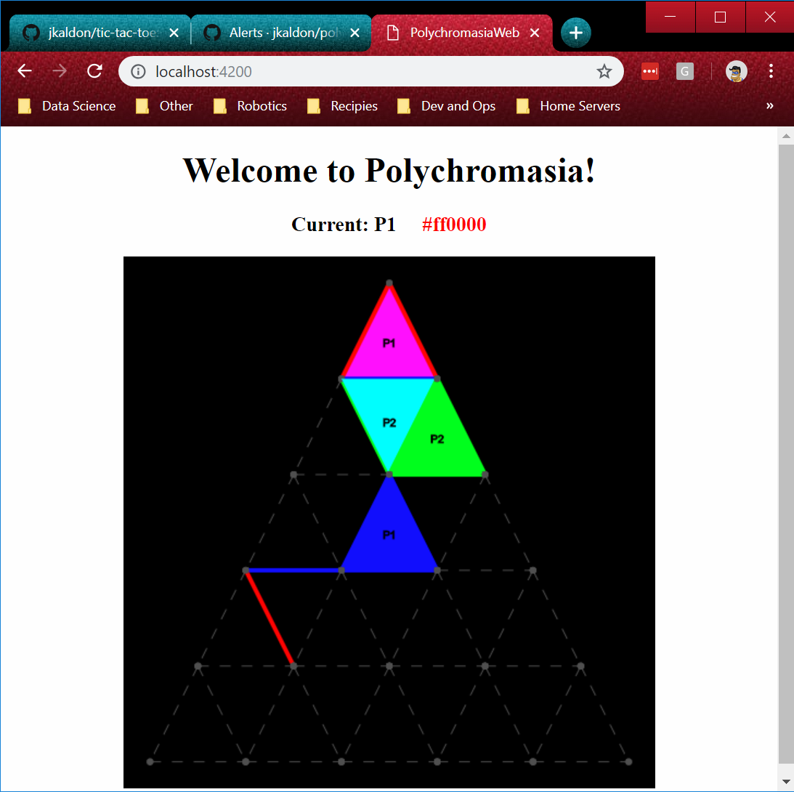

# PolychromasiaWeb



## To run
Run the angular project using the command below and then open your browser to http://localhost:4200 to play.
```
$ ng serve   
```

## Known problems
```
ERROR in node_modules/canvasimo/build/index.d.ts(61,52): error TS2304: Cannot find name 'Canvas2DContextAttributes'.
...
Failed to compile.
```
* Waiting for a [permanent fix](https://github.com/JakeSidSmith/canvasimo/issues/120), but added `"skipLibCheck": true` to `tsconfig.json` for a temporary fix.
* Scoring is not implemented.

## Notes

### Spots on board: n * n

### Spots in row: 2 * n - 1

### Connections:3 * n * (n + 1) / 2
